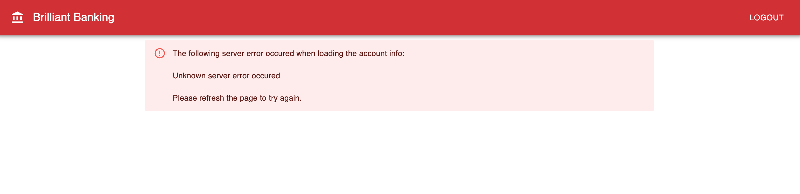
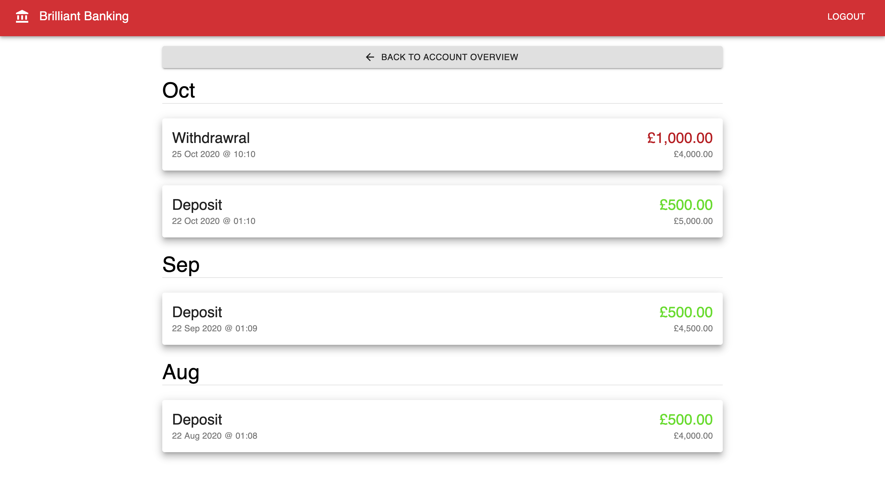

This is the UI for the Brilliant Banking application. Follow the instructions below to get started, then read on to see the challenges!

# Getting Started
1. Ensure you have started the backend server, if not follow the instructions in the [brilliant-banking-server-challenge](https://github.com/nighk/brilliant-banking-server-challenge) README before continuing
2. Clone this repo
3. Run `npm i`
4. Run `npm start`
5. Navigate to `http://localhost:3000` in your browser
6. Login with the username of `user` and password of `ilovebanking`
7. If you get a continous loading bar after loggong in just refesh the page, you will fix this issue as part challenge 1!

# Environment Variables
The below is for information only. The variables are defauled in the `.env` and not need to be changed when running a standard local setup.

* REACT_APP_SERVER_HOSTNAME = The full URL for the backend server

# Challenges
## 1. Accounts not loading

Several users of the banking app have reported that sometimes their list of accounts won't load, can you find the error and modify the **UI** code to cater for it?

One suggestion is to simply display an error message telling the user to refresh the page like the screenshot below, although feel free to think of a better solution if you want to ;-)

**Hint:** You may need to refesh the home page several times to re-create the bug

## 2. Sort & Group transactions by month

Currently on the transactions page, displayed after clicking on an account, all the transactions are muddled up and difficult to read. Users have requested that they be placed into date order and grouped by month. Update the **UI** code to sort/group the transactions nd display them in a way similar to the screenshot below.

**Hint:** Transactions are received from the REST API as an array of objects, each one has a `dateTime` property. 

## 3. Display transaction details

The users would like to see another screen where they can drill into the details of their transaction. Currently there is only one additional property called `reference` that isn't shown, however Brilliant Banking would like the option to easily add more information later, so try and create a screen that could also cater for additional information. One idea is to create a popup when a card is clicked like the screenshot below, but equally you could make a separate page as well.

**Hint:** To speed up development here are a full list of the properties on each transaction object:
* type (valid values are `in` or `out`)
* dateTime
* amount
* accountBalance (after transaction)
* title
* reference

## 4. Stretch Goal

Think about how the application could be improved with regards structure, security, testing, and functionality.